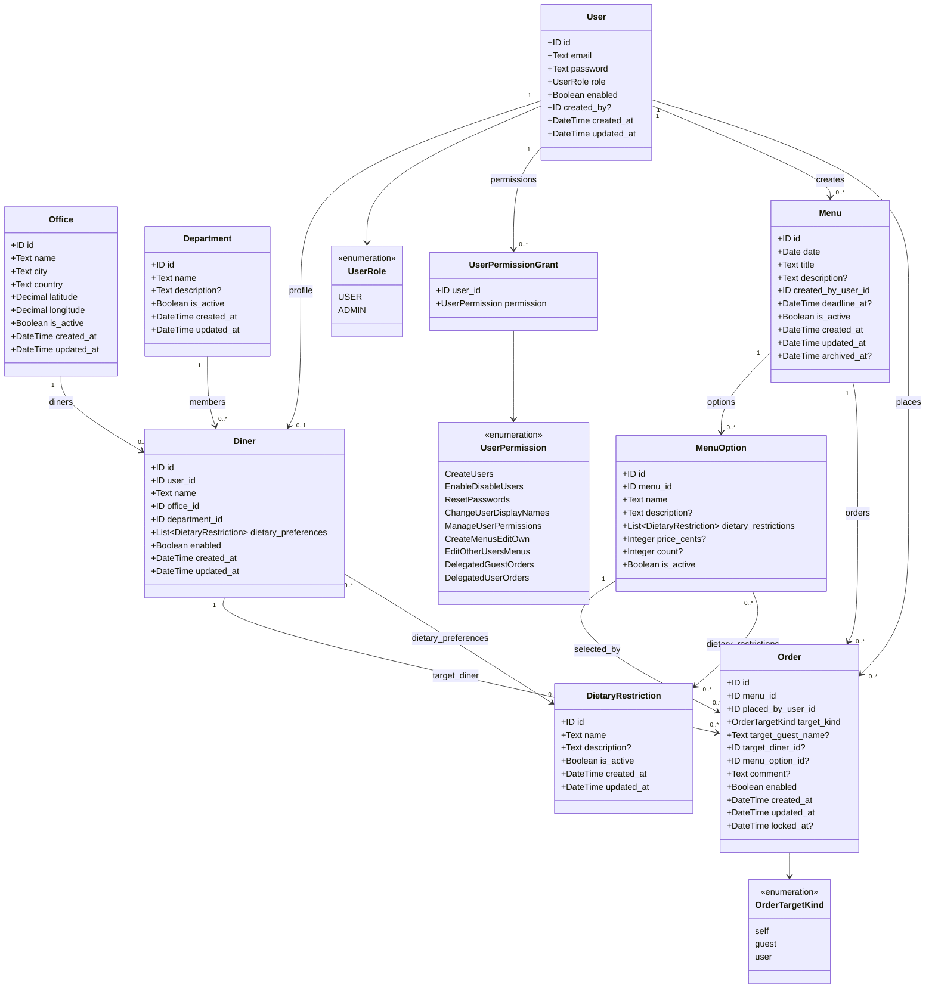

```mermaid
classDiagram
  class User {
    +ID id
    +Text email
    +Text password
    +UserRole role
    +Boolean enabled
    +ID created_by?
    +DateTime created_at
    +DateTime updated_at
  }


  class Diner {
    +ID id
    +ID user_id
    +Text name
    +ID office_id
    +ID department_id
    +List~DietaryRestriction~ dietary_preferences
    +Boolean enabled
    +DateTime created_at
    +DateTime updated_at
  }


  class Office {
    +ID id
    +Text name
    +Text city
    +Text country
    +Decimal latitude
    +Decimal longitude
    +Boolean is_active
    +DateTime created_at
    +DateTime updated_at
  }


  class Department {
    +ID id
    +Text name
    +Text description?
    +Boolean is_active
    +DateTime created_at
    +DateTime updated_at
  }


  class UserPermissionGrant {
    +ID user_id
    +UserPermission permission
  }


  class Menu {
    +ID id
    +Date date
    +Text title
    +Text description?
    +ID created_by_user_id
    +DateTime deadline_at?
    +Boolean is_active
    +DateTime created_at
    +DateTime updated_at
    +DateTime archived_at?
  }


  class MenuOption {
    +ID id
    +ID menu_id
    +Text name
    +Text description?
    +List~DietaryRestriction~ dietary_restrictions
    +Integer price_cents?
    +Integer count?
    +Boolean is_active
  }


  class Order {
    +ID id
    +ID menu_id
    +ID placed_by_user_id
    +OrderTargetKind target_kind
    +Text target_guest_name?
    +ID target_diner_id?
    +ID menu_option_id?
    +Text comment?
    +Boolean enabled
    +DateTime created_at
    +DateTime updated_at
    +DateTime locked_at?
  }


  class DietaryRestriction {
    +ID id
    +Text name
    +Text description?
    +Boolean is_active
    +DateTime created_at
    +DateTime updated_at
  }


  class UserPermission {
    <<enumeration>>
    CreateUsers
    EnableDisableUsers
    ResetPasswords
    ChangeUserDisplayNames
    ManageUserPermissions
    CreateMenusEditOwn
    EditOtherUsersMenus
    DelegatedGuestOrders
    DelegatedUserOrders
  }


  class UserRole {
    <<enumeration>>
    USER
    ADMIN
  }


  class OrderTargetKind {
    <<enumeration>>
    self
    guest
    user
  }


  User "1" --> "0..1" Diner : profile
  User --> UserRole
  User "1" --> "0..*" UserPermissionGrant : permissions
  User "1" --> "0..*" Menu : creates
  User "1" --> "0..*" Order : places
  Diner "1" --> "0..*" Order : target_diner
  Office "1" --> "0..*" Diner : diners
  Department "1" --> "0..*" Diner : members


  Menu "1" --> "0..*" MenuOption : options
  Menu "1" --> "0..*" Order : orders


  MenuOption "1" --> "0..*" Order : selected_by


  Diner "0..*" --> "0..*" DietaryRestriction : dietary_preferences
  UserPermissionGrant --> UserPermission
  Order --> OrderTargetKind
  MenuOption "0..*" --> "0..*" DietaryRestriction : dietary_restrictions
```
